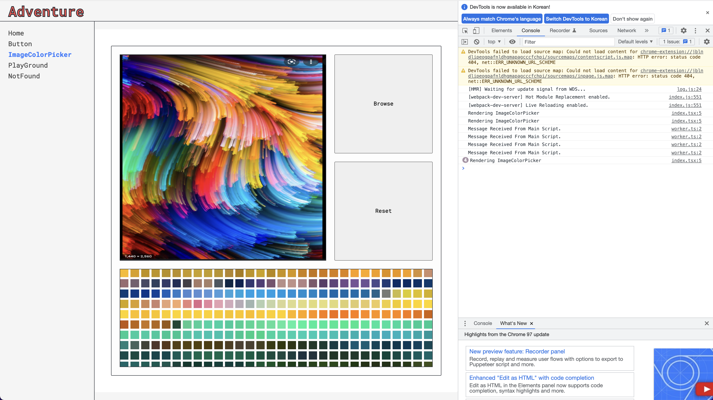

# ImageColorPicker

이미지를 업로드하면 `HTMLCanvasElement`를 통해 `ImageData`를 생성하여 내부 이미지의 유일한 색상 목록을 획득하는 컴포넌트

## Problems

> 다중의 `WebWorker`를 통해 이미지 데이터 버퍼를 분석하는 작업을 나누어 진행했는데 `postMessage`, `onMessage` 의 주고받음을 콜백함수 대신 `Promise`를 통해 할 수 있는 방법은 없나 ? 함수형 컴포넌트 내부에 `MessageCount` 변수를 선언해서 `WebWorker` 인스턴스가 메인 스레드쪽으로 발생시킨 메시지콜 카운트를 세서 작업의 완료를 확인하는 상황이다. 그리고 `useState()`의 값을 설정하는 함수를 동작시킬때마다 리렌더링 시퀀스를 발생시키기 때문에 `WebWorker` 인스턴스의 작업이 완료된 것을 취합후 한번의 리렌더링에 모두 처리하고 싶다.

> 컴포넌트 하단에 렌더링하는 컬러 블록의 정렬 또한 이슈가 있다. 작업 순서대로 컬러블록을 위에서 아래로 리스팅하고 있기 때문에 일반적인 `ColorPicker` 처럼 직관적인 색상 선택이 어렵다. 정렬할 수 있는 방법을 찾아보자.

## History

### `[2022-01-10]`

컴포넌트를 계속 사용하다가 고해상도, 다양한 색상을 갖는 이미지를 로드해서 테스트 해봤는데 브라우저가 그냥 뻗어버렸다. 왜 그런지 이유를 한번 생각해봤다. 우선 고해상도의 이미지가 브라우저를 뻗게 만드는 원인이라고는 생각되지 않았다. 왜냐하면 500 x 500 사이즈에 해당하는 캔버스에 이미지를 로드하고 픽셀 데이터를 가져오기 때문에 `Worst Case` 는 25000 픽셀에 모든 고유의 색상값이 존재하는 경우 한번에 25000 개의 컬러 블록을 하단 영역에 렌더링하게 된다. (postMessage 콜카운트와 웹 워커 생성 개수가 같아질때 렌더링 진행)

기본 로직을 이 [링크](https://blog.rhostem.com/posts/2021-01-03-image-load-by-web-worker)를 참고해서 좀 변경하고 실험적으로 두가지 조치를 취해보고자 한다.

**`웹 워커 생성 개수만큼 콜카운트를 기다리지 말고 개별 웹 워커가 작업을 마치고 콜백을 발생시킬 때마다 리렌더링하게 놔두기`**

먼저 `navigator.hardwareConcurrency` 라는 프로퍼티를 통해서 스레드를 실행하는 때 사용할 수 있는 논리 프로세서의 수를 확인할 수 있다는 것을 알게 되었다. 이번에 구입한 `M1 MacBook Pro 16`은 `10`을 반환했다. (_뿌듯_) 근데 또 생각해보니까 `[R,G,B,A,R,G,B,A]` 형태로 되어있는 TypedArray 를 논리 프로세서 수에 따라 정확히 등분하기가 어려웠다.

`Set<(R,G,B,A)[]>()` 로 유일한 색상을 취합할 것이기 때문 !

그래서 일단 최대 워커 생성 개수는 `4` 로 고정하고 진행했다. 그리고 아래의 컬러 바리에이션이 아주 풍부한 이미지를 사용해봤다.



웹 워커의 메시지가 도착할때 마다 작업을 진행하니까 한번에 전체 데이터를 그릴때와 비교해서 브라우저가 뻗지는 않았으나 여전히 버벅임이 심했다.

**`무한 스크롤 UI + 전체 데이터 슬라이싱을 통해 지연 렌더링 하기`**

첫번째 단계의 로직에서 이번에는 무한 스크롤 UI를 적용해보기로 한다. 이제는 우리가 서로 익히 알고 있듯이 무한 스크롤 UI에 사용되는 조건문은 공식처럼 되어버렸는데 다음과 같다.

```ts
const onScrollColorBlockContainer: EventListener = (event) => {
  const eventTarget = event.target;
  if (eventTarget instanceof HTMLElement) {
    const { scrollHeight, scrollTop, clientHeight } = eventTarget;

    if (scrollTop + clientHeight >= scrollHeight - 20) {
      setSliceCursor(sliceCursor + 600);
    }
  }
};
```

전체가 취합된 `Set`을 순회를 통해 렌더링 하지 않고 `Cursor` 라는 개념을 두어서 0번째 인덱스부터 이벤트마다 증가하는 `Cursor` 인덱스까지만 추가적으로 렌더링 하도록 조치한다. `Reconcliation` 과정에 의해 한번 그려졌던 유일한 색상의 컬러블록은 다시 렌더링 되지 않을 것이라 판단하고 있다.

```jsx
<section
  className="Image-Color-Picker__Wrap__Box-Bottom"
  onScroll={onScrollColorBlockContainer}
>
  {uniqueSlicedColors.map((color) => (
    <div
      className="block"
      key={color} // unique rgba(r,g,b,a)
      style={{ backgroundColor: color }}
    />
  ))}
</section>
```

결과적으로 어떤 고해상도나 풍부한 색상을 갖는 이미지를 로드해도 브라우저가 버벅이거나 뻗어버리지 않도록 조치했다. 추가적으로 리액트 훅을 잘 모르고 사용하고 있는 것 같아서 걱정이 되었다.

## References

- [Image-Load-By-Web-Worker](https://blog.rhostem.com/posts/2021-01-03-image-load-by-web-worker)
